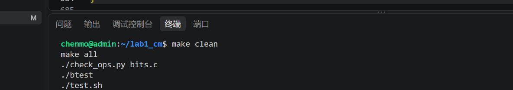
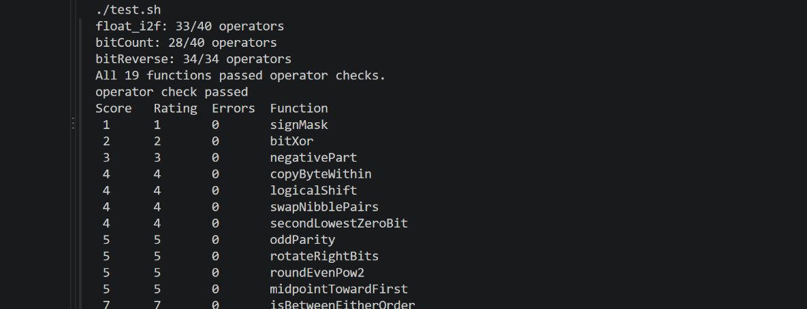
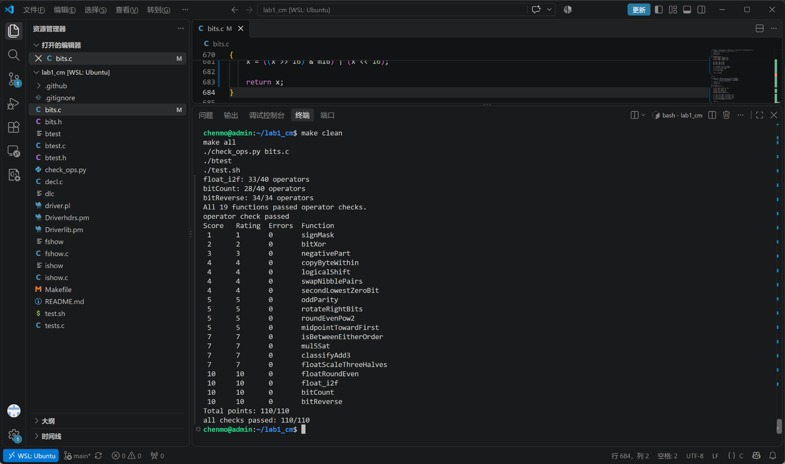

# Lab1：DataLab 实验报告

**课程：** 计算机系统基础（AIE210006.01）  
**姓名：** 陈默  
**学号：** 24307130078
**实验名称：** Lab1：DataLab  
**实验日期：** 2026-10-08

## 1. 实验目的

本实验通过受限的整数运算与 IEEE 754 单精度浮点数位级操作，加深对 32 位二进制补码、掩码、移位、溢出、舍入以及浮点数编码方式的理解。实验要求仅修改 `bits.c` 中 P1–P19 的函数体，并同时通过运算符规则检查和正确性测试。

## 2. 实验环境与测试方法

实验在 WSL Ubuntu 的 x86-64 Linux 环境中完成，并安装了 32 位编译支持。主要测试流程如下：

```bash
make clean
make all
./check_ops.py bits.c
./btest
./test.sh
```

### 2.1 运算符规则检查

执行 `./check_ops.py bits.c` 后，19 个函数均通过运算符及最大操作数检查。



### 2.2 正确性测试

执行 `./btest` 后，19 道题 `Errors` 均为 0，总分为 `110/110`；进一步执行 `./test.sh` 后得到 `all checks passed: 110/110`。



完整终端结果如下：



## 3. 各函数实现思路

### P1 `signMask`

使用 `1 << 31` 将最低位的 1 移到最高位，得到仅符号位为 1 的 `0x80000000`。该实现无需使用大常量，并满足操作数限制。

### P2 `bitXor`

题目仅允许使用 `~` 和 `&`。根据异或逻辑“两个位不同则为 1”，利用德摩根律改写为：

```text
x ^ y = ~(x & y) & ~(~x & ~y)
```

从而在不使用 `^` 的情况下实现异或。

### P3 `negativePart`

利用算术右移得到符号掩码：负数右移 31 位得到全 1，非负数得到全 0。再用补码关系 `-x = ~x + 1` 计算相反数，并与符号掩码按位与，使非负输入直接得到 0。

### P4 `copyByteWithin`

先通过 `src << 3` 和 `dst << 3` 计算源字节和目标字节的位偏移。使用 `0xFF` 提取源字节，再构造目标字节掩码，将目标位置清零后写入复制出的字节，其余位保持不变。

### P5 `logicalShift`

由于有符号整数的 `>>` 为算术右移，负数会在高位补 1，因此先执行算术右移，再构造高位清零掩码，将补出的符号位清除，从而得到逻辑右移结果。

### P6 `swapNibblePairs`

构造 `0x0F0F0F0F` 掩码，分别提取每个字节的低 4 位与高 4 位。低 4 位左移 4 位，高 4 位右移 4 位后再使用掩码清除符号扩展，最后按位或完成每个字节内部高低半字节交换。

### P7 `secondLowestZeroBit`

先对 `x` 取反，将原数中的 0 位转换为 1 位。利用 `a & (~a + 1)` 提取最低位的 1，清除该位后再次提取最低位的 1，即得到原数中第二低的 0 位。若不存在第二个 0，自然返回 0。

### P8 `oddParity`

采用 XOR folding。依次将 32 位按 16、8、4、2、1 位对折异或，最终最低位表示原数所有 bit 的异或结果，即 1 的个数奇偶性。题目要求偶数个 1 返回 1，因此最后对最低位结果取反。

### P9 `rotateRightBits`

先使用 `n & 31` 得到实际旋转位数，避免大于 31 的移位。右移部分通过掩码实现逻辑右移，左移部分移动 `32-k` 位，再将两部分按位或，即得到循环右移结果。对 `k=0` 的情况也通过按 31 取模避免移位 32 位。

### P10 `roundEvenPow2`

目标是将非负整数舍入到最近的 `2^n` 倍数，并在中点时采用 round-to-even。先计算 `half = 2^(n-1)`，然后根据当前商的奇偶性构造偏置：

```text
bias = half - 1 + ((x >> n) & 1)
```

加上偏置后右移、再左移，可以同时处理普通四舍五入和中点取偶数。

### P11 `midpointTowardFirst`

不能直接计算 `(x+y)/2`，因为 `x+y` 可能溢出。利用：

```text
(x & y) + ((x ^ y) >> 1)
```

计算不溢出的向下中点。当 `x+y` 为奇数且 `x>y` 时，再加 1，使结果向第一个参数 `x` 的方向取整。比较 `x>y` 时分别处理同号和异号情况，避免减法溢出。

### P12 `isBetweenEitherOrder`

分别判断 `x<a` 和 `x<b`。若两个比较结果不同，说明 `x` 严格位于 `a`、`b` 之间；若 `x` 等于任一端点也应返回 1。比较过程根据符号是否相同分别处理，以避免直接计算差值时发生有符号溢出。

### P13 `mul5Sat`

将 `x*5` 分解为 `2x`、`4x`、`5x` 三步加法。每一步根据加数和结果的符号变化判断是否溢出，只要发生溢出，就根据原输入符号选择 `INT_MAX` 或 `INT_MIN`；否则返回正常的 `5x` 结果。

### P14 `classifyAdd3`

将三数求和分成 `s1=x+y` 和 `s2=s1+z` 两次加法，分别识别正溢出与负溢出。由于第一次溢出可能在第二次加法中被反向抵消，因此分别记录两次溢出方向，再组合判断数学意义上的最终和是超出 `INT_MAX`、低于 `INT_MIN`，还是仍处于合法范围。

### P15 `floatScaleThreeHalves`

先拆出符号位、阶码和尾数。NaN 和无穷大直接原样返回；非规格化数没有隐藏的最高位 1，因此直接对尾数乘 3 后除 2，并按 round-to-nearest-even 舍入。规格化数先补回隐藏位，再根据乘以 `3/2` 后是否需要重新规格化调整阶码，同时处理舍入进位和溢出到无穷大的情况。

### P16 `floatRoundEven`

根据阶码判断数值范围。绝对值小于 0.5 时返回带原符号的 0；位于 `[0.5,1)` 时分别处理恰好 0.5 和大于 0.5 的情况；指数足够大时原数已经是整数，直接返回。其余情况计算需要舍弃的小数位，并根据“余数与 half 的关系”和保留部分最低位奇偶性实现 round-to-nearest-even。

### P17 `float_i2f`

先保存符号并计算整数绝对值，然后寻找最高位 1 的位置，由此确定浮点数阶码。若有效位不超过 24 位，可直接左移形成尾数；否则需要丢弃低位，并根据被丢弃部分与 half 的大小关系执行 round-to-nearest-even。若舍入导致有效数由 `1.111...` 变为 `10.000...`，则右移一位并增加阶码。

### P18 `bitCount`

使用并行位计数方法。依次构造 `0x55555555`、`0x33333333`、`0x0F0F0F0F` 掩码，将相邻 2 位、4 位、8 位中的 1 的个数逐层合并，随后再合并 16 位和 32 位，最终低 6 位保存 0–32 的总计数。

### P19 `bitReverse`

采用分治式位交换。先交换相邻 1 位，再交换相邻 2 位、4 位、8 位和 16 位。通过逐级构造 `0x55555555`、`0x33333333`、`0x0F0F0F0F`、`0x00FF00FF` 和 `0x0000FFFF` 掩码，在 34 个操作数限制内完成 32 位反转。

## 4. 实验结果

最终本地测试结果为：

```text
All 19 functions passed operator checks.
Total points: 110/110
all checks passed: 110/110
```

代码推送到 GitHub 后，课程提供的 GitHub Actions 自动评分也成功通过，19 个题目的测试步骤均为 `success`。

## 5. 参考资料与辅助工具

1. 复旦大学 ICS 26 Fall，Lab1：DataLab 实验文档：  
   https://ics-26fall-fdu.github.io/labs/lab1-data-lab/
2. 课程 DataLab 模板仓库中的 `README.md` 与 `bits.c` 题目说明：  
   https://github.com/ICS-26Fall-FDU/DataLab
3. *Computer Systems: A Programmer's Perspective (CS:APP)* 中关于整数表示、位运算与 IEEE 754 浮点数的相关内容。
4. 在实验调试与报告整理过程中使用 ChatGPT 辅助讨论位运算思路、IEEE 754 边界情况及测试结果；最终实现均通过课程提供的 `check_ops.py`、`btest`、`test.sh` 和 GitHub Actions 检查。

## 6. 实验体会

本实验中最直观的体会是：很多看似依赖高级语法的操作，都可以转换为补码、掩码和移位的组合。前半部分主要训练位运算等价变换和溢出处理，后半部分则进一步涉及 IEEE 754 中规格化、非规格化、隐藏位以及 round-to-nearest-even 等细节。通过逐题进行规则检查和单题测试，可以较快定位错误，也能更清楚地区分“代码写法是否合法”和“计算结果是否正确”这两个问题。
